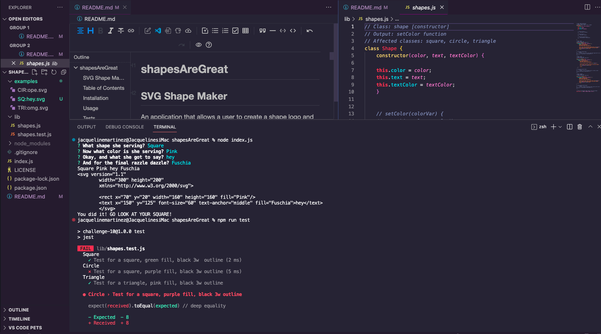
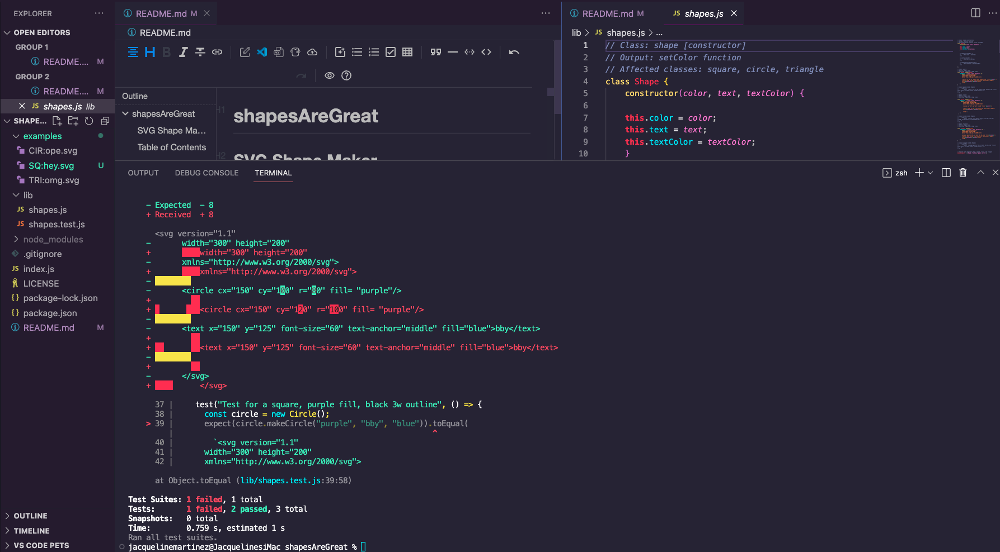
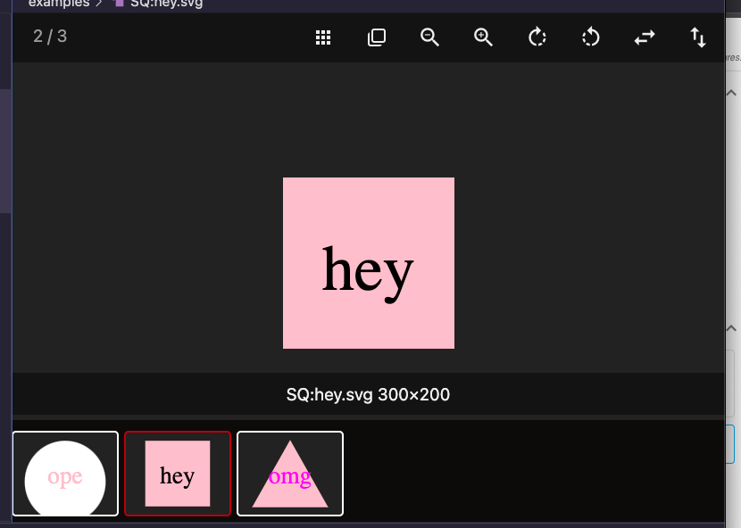

# shapesAreGreat

## SVG Shape Maker

An application that allows a user to create a shape logo and design it with their initials

## Table of Contents

- [Installation](#installation)
- [Usage](#usage)
- [Credits](#credits)
- [License](#license)

## Installation

This SVG Logo maker begins by cloning the repo
https://github.com/jackieAmartinez/logoGenerator.git 

Open in VS code and then open index.js in the integrated terminal, install node.js, 

After node.js is installed in the terminal you will use the command npm init -y to initialize and create a package.json where project files will be stored. 

After this is done in the terminal type npm i to install the dependencies. 

To run the application in the terminal you will ned to type the command node index.js 

## Usage

https://drive.google.com/file/d/1eoH4WcM8f0aaGaJEc1H315jFAfZtJ7LE/view

## Tests

To run the tests type npm run test into the terminal.

## Credits

**_Lindsey Isaac_** https://github.com/lindseyisaac 
**_M Vincent Richards_** https://github.com/vrich88 
**_Matt Montiel_** https://github.com/MatthewMontiel 
**_Danny Cohen_** https://github.com/dctristero 
**_TA assistance from Rachel Solov_** 

## License

MIT License

Copyright (c) 2023 jackieamartinez
